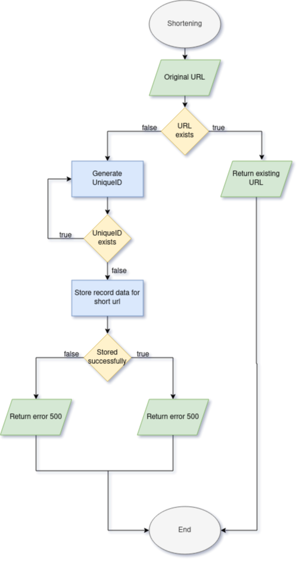
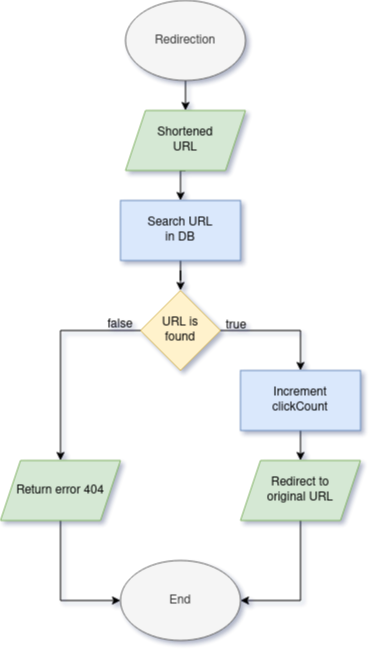

<p align="center">
  <a href="http://nestjs.com/" target="blank"></a>
</p>

# Short'n'Sweet - URL shortener para equipes de desenvolvimento

## Description

Short'n'Sweet é um URL shortener pensado para equipes de desenvolvimento que necessitem de ter acesso facilitado a links minificados, sem se submeter às tarifas impostas pelos sites comerciais. 

Outra motivação, é dar mais liberdade ao desenvolvedor para utilizar endereços que saiam dos protocolos standard para URLs, como `didcomm://`, e gerar links http para estes protocolos, especialmente para testes de comunicação com NFC. 

A motivaçao final é aceitar URLs com tamanho que passe do aceito pela média dos shorteners comerciais (possivelmente 256 caracteres). Nós permitiremos URLs que tenham até 2Kb de tamanho, fazendo que assim tenhamos endereços encurtados para protocolos de comunicação especiais, próprios para o desenvolvimento. 


## Minificando
<div align="center">
  
</div>

## Redirecionando
<div align="center">
  
</div>

## Instalação

Inicialmente, a instalação do dos pacotes nodejs é feita com o `npm`:  
```bash
$ npm install
```

Em seguida, para o deploy da aplicação, é necessário criar um arquivo `.env` na raiz da aplicação, e informar o conteúdo abaixo: 

```bash
# Variables d'environnement
APP=shortnsweet
SUFFIX=dev
NETWORK=shortnsweet-network
MODE=DEV
SECRET=

# Variables d'environnement de la bd MySQL
MYSQL_HOST=db
MYSQL_PORT=3307
MYSQL_ROOT_PASSWORD=
MYSQL_USER=juliozohar
MYSQL_PASSWORD=
MYSQL_DATABASE=shortnsweet

# TypeORM 
# Em ambientes de desenvolvimento e homologação, setar para true
# IMPORTANTE: PARA AMBIENTE DE PRODUÇÃO, SETAR PARA false!!!!!
SYNCHRONIZE=true

```

## Executando a aplicação

Para a execução do projeto localmente, seguir os comandos abaixo: 

```bash
# development
$ npm run start

# watch mode
$ npm run start:dev

# production mode
$ npm run start:prod
```

O caso de utilização mais comum, no entanto, será via container `docker`. Para executar o projeto containerizado, seguir os comandos abaixo: 

```bash
# Na primeira utilização, ou após modificações: 
$ docker-compose build 

# Em seguida, lançar a aplicação
$ docker-compose up 

```

Parar a aplicação: 

```bash
$ docker-compose stop 
```

Remover os containers (em seguida, será obrigatório refazer o build dos containers):

```bash
$ docker-compose down 
```

## Criação do registro no Short'n'Sweet 

Uma vez que a aplicação esteja no ar, é necessário acessar a funcionalidade de criação do registro via Swagger http://www.shortnsweet.link/api 

No endpoint `POST /short-url`, colar o payload seguinte para a criação da url 

```json 
{
    "originalUrl": "https://www.longo-url-que-sera-diminuido",
    "uniqueId": "", 
    "numberClicks": 0, 
    "user": "nomedousuario"
}
```

## Testes

```bash
# unit tests
$ npm run test

# e2e tests
$ npm run test:e2e

# test coverage
$ npm run test:cov
```

## Suporte

Como obter suporte para o Short'n'Sweet? 

## Stay in touch

- Author - [Julio Torres](https://kryptogarten.ca)
- Website - [https://www.shortnsweet.link](https://www.shortnsweet.link/)

## License

Short'n'Sweet is [MIT licensed](LICENSE).

